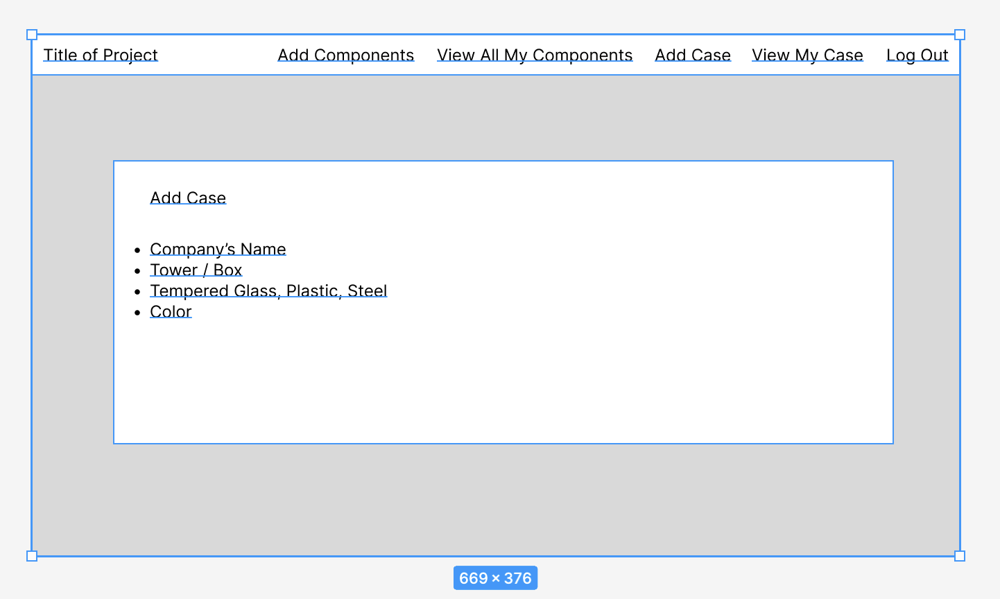

# BARcode - BUILD AND SHOW YOUR DREAM COMPUTER

### Purpose: Show off your pc build with all the specs that you have on it.

### Getting Started:
- Click on the link below
- Sign up by clicking on the 'Sign Up' tab
- Fill in the required field to create an account 
- Once you're logged in, create the case that you want to show off
- Create the components that your computer has and add it to the case that you have created

### LINK: https://barcodepc.herokuapp.com/

### Screenshots:

### [ERD] (https://lucid.app/lucidchart/b05595d0-7f3d-4710-b63e-ac5b7ada8c1a/edit?viewport_loc=-882%2C-2388%2C3072%2C1692%2C0_0&invitationId=inv_00e8ed67-77e5-4264-8561-0a212fba43db#)

### [TRELLO BOARD] (https://trello.com/b/qQCsK80G/project-3)

### [WIREFRAME] (https://www.figma.com/file/Np16NcmnRl4ZWcgpoM4BXb/Project-3-WireFrame?node-id=2%3A64)

## USED TECHNOLOGIES:
*Python 
*Django 
*HTML
*CSS 
*Bootstrap 
*Heroku 
*AWS 
*PostgreSQL

## ICEBOX: 
- Allow user to upload profile picture
- Allow user to upload component's picture
