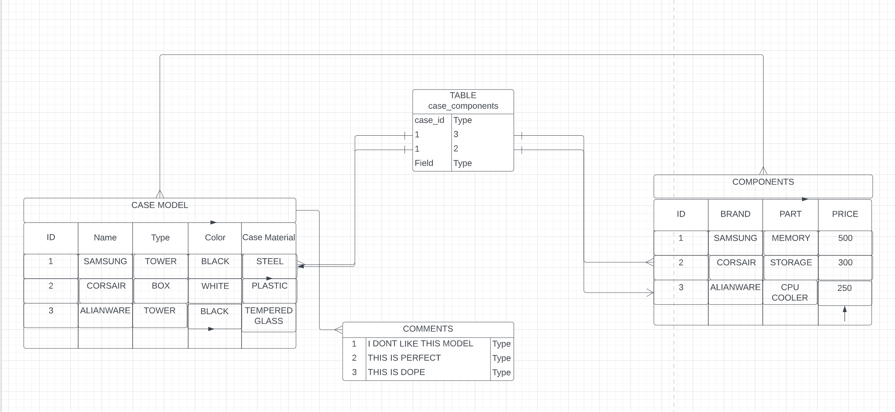
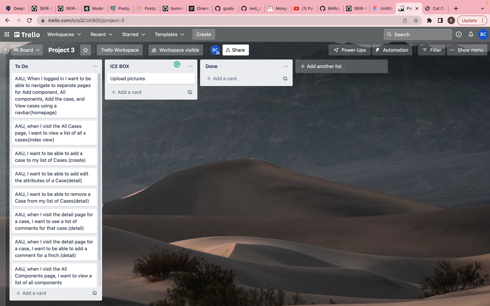
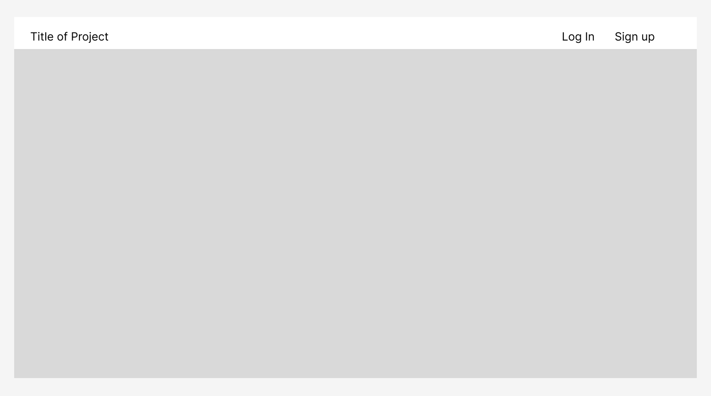
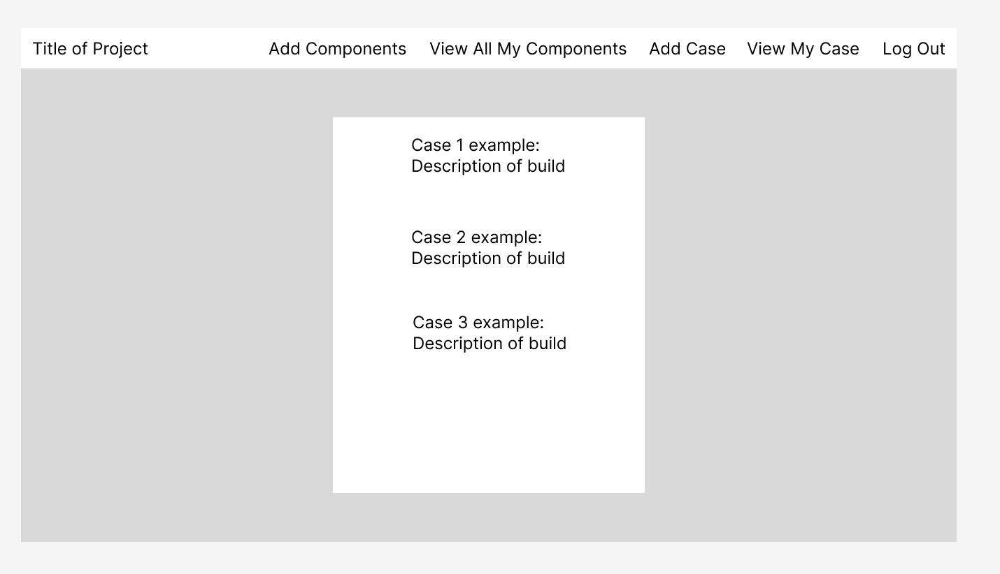
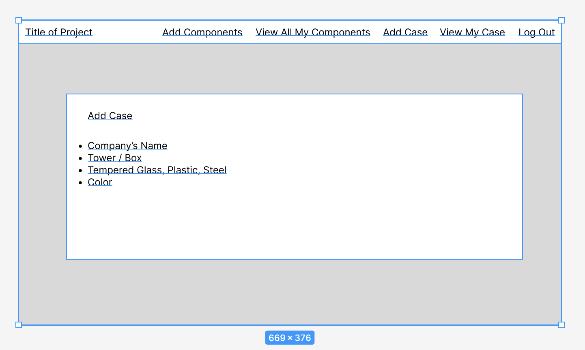
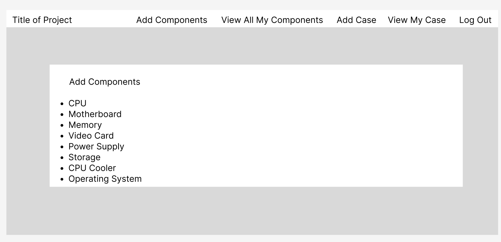
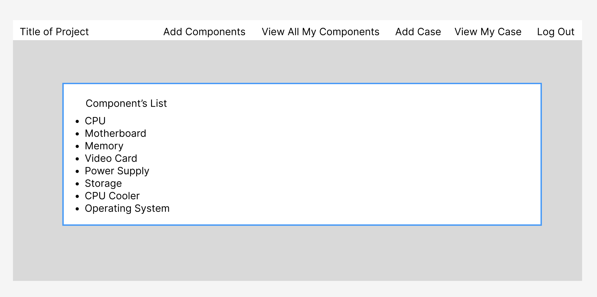

# BARcode - BUILD YOUR DREAM COMPUTER
### LINK:  

### Purpose: 

### [ERD] (https://lucid.app/lucidchart/b05595d0-7f3d-4710-b63e-ac5b7ada8c1a/edit?viewport_loc=-882%2C-2388%2C3072%2C1692%2C0_0&invitationId=inv_00e8ed67-77e5-4264-8561-0a212fba43db#)

### [TRELLO BOARD] (https://trello.com/b/qQCsK80G/project-3)

### [WIREFRAME] (https://www.figma.com/file/Np16NcmnRl4ZWcgpoM4BXb/Project-3-WireFrame?node-id=2%3A64)

## USED TECHNOLOGIES:
*Python 
*Django 
*HTML
*CSS 
*Bootstrap 
*Heroku 
*AWS 
*PostgreSQL

## CHECK OUT THIS LINK: https://team-creator-sei523.herokuapp.com/

delete this line

## ICEBOX: Game Results Page, Sort by groups and Sport Data API

Testing Baoying!!!!